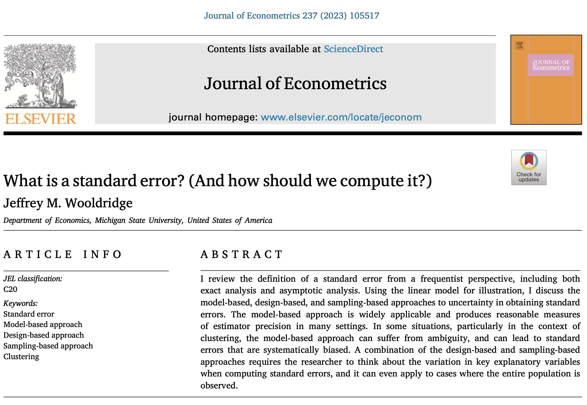

```{r setup, results='hide', warning=FALSE, message=FALSE}
# The first line sets an option for the final document that can be produced from
# the .Rmd file. Don't worry about it.
knitr::opts_chunk$set(echo = TRUE)

# The next bit (lines 50-69) is quite powerful and useful. 
# First you define which packages you need for your analysis and assign it to 
# the p_needed object. 
p_needed <-
  c("viridis", "knitr")

# Now you check which packages are already installed on your computer.
# The function installed.packages() returns a vector with all the installed 
# packages.
packages <- rownames(installed.packages())
# Then you check which of the packages you need are not installed on your 
# computer yet. Essentially you compare the vector p_needed with the vector
# packages. The result of this comparison is assigned to p_to_install.
p_to_install <- p_needed[!(p_needed %in% packages)]
# If at least one element is in p_to_install you then install those missing
# packages.
if (length(p_to_install) > 0) {
  install.packages(p_to_install)
}
# Now that all packages are installed on the computer, you can load them for
# this project. Additionally the expression returns whether the packages were
# successfully loaded.
sapply(p_needed, require, character.only = TRUE)
```

------------------------------------------------------------------------

# Program for today

In this session, we will learn about more about maximum likelihood estimation:

1. Maximum Likelihood Standard Errors

    - Where do they come from?
    - How do we calculate them?
    - How are they different from OLS standard errors for linear model?
    
2. Bootstrapping

    - What is it?
    - What is it good for?
    
3. The Likelihood-Ratio Test for Nested Models

    - Implementation for linear regression models
    
------------------------------------------------------------------------

This week is (almost) all about standard errors. So before we dive into the technicalities of MLE standard errors, let's repeat some general basics about them.

  - Try to answer the following question in plain language: What is the purpose of calculating standard errors?
  - Can you give precise definition of the term "standard errors"?
  
  
If you are unsure about the latter question...



# Maximum Likelihood Standard Errors

So far we only calculated point estimates via maximum likelihood. Usually, we also want to know how accurate our estimates are, i.e. we want to calculate **standard errors** of those estimates. In the lecture yesterday you learnt how to derive standard errors for MLE.

The curvature of the likelihood function around the maximum can provide this information. Intuitively, if the likelihood function has a sharp peak, we can be quite certain about our estimates, while we are less certain when the function is relatively flat around the peak.

```{r lik1, echo=FALSE, fig.height=3, fig.width=6}
par(mfrow = c(1, 2))
curve(-0.3*x^2,
      from = -2,
      to = 2,
      main = "A Likelihood Function",
      font.main = 1,
      ylim = c(-7, 7),
      yaxt = "n",
      xaxt = "n",
      ylab = "Likelihood",
      xlab = expression(paste("Parameter ", theta)),
      bty = "n",
      lwd = 2,
      col = viridis(1))
abline(v = 0,
       col = viridis(2)[2])
curve(-3*x^2,
      from = -2,
      to = 2,
      main = "Another Likelihood Function",
      font.main = 1,
      ylim = c(-7, 7),
      yaxt = "n",
      xaxt = "n",
      ylab = "",
      xlab = expression(paste("Parameter ", theta)),
      bty = "n",
      lwd = 2,
      col = viridis(1))
abline(v = 0,
       col = viridis(2)[2])
```

Given the shape of these (hypothetical and simplified) likelihood functions, we are more certain about the parameter estimated by the right likelihood function than we are about the parameter on the left. 

In the lecture we have seen that the **Fisher Information Matrix** plays a crucial role when we want to calculate MLE standard errors and subsequently apply these to test hypothesis. The reason is that this matrix closely corresponds to the asymptotic variance-covariance matrix. The Fisher Information Matrix is defined as:

$$
\begin{aligned}
     I(\theta|y) &= - E\underbrace{\left[\frac{\partial^2 \ell(\theta|y)}{\partial \theta \partial \theta'}\right]}_{\text{Hessian Matrix}} \\
     &= - E\left[H(\theta)\right]
\end{aligned}
$$

The Hessian matrix is a matrix of second derivatives of the log-likelihood function with respect to parameters (or the derivatives of the Score, or the rate of change of the rate of change). 

*What is in this formula and how is related to the curvature of the curve?*

Below you can see two _stylized_ log-likelihood functions. Let's say that we can approximate the curvature of these log-likelihood function in the area around the maximum with quadratic functions:

$$
f_1(\theta) = -0.3\theta^2 \, \text{and} \, f_2(\theta) = -3\theta^2
$$
These would be the first derivatives, the indicators of the instantaneous rate of change in $f(\theta)$ at some value $\theta_0$.

$$
f_1'(\theta) = 2 \cdot(-0.3\theta) = -0.6\theta \;  \text{and} \; f_2'(\theta) = -3\theta^2 = -6\theta
$$
And now the second derivatives, i.e. the rate of change of the rate of change. 

$$
f_1''(\theta) = - 0.6 \; \text{and} \; f_2''(\theta) = -6
$$
And to relate the Hessian to Information matrix, let's look at the *negatives* of second derivatives (the expectations of a constant are a constant): 

$$
-f_1''(\theta) = 0.6 \, \text{and} \, -f_2''(\theta) = 6
$$

The negative second derivate of the first function is lower than the negative second derivative of the second function. Now ask yourself: From just looking at the curvature of the two log-likelihood functions, would you be more certain about the maximum likelihood estimate of the first function or of the second function? And does this fit to their values of the negative second derivative?


```{r lik2, echo=FALSE,  fig.height=5, fig.width=8}
par(mfrow = c(1, 2))
curve(-0.3*x^2,
      from = -2,
      to = 2,
      main = "A Log-Likelihood Function",
      font.main = 1,
      ylim = c(-7, 7),
      yaxt = "n",
      xaxt = "n",
      ylab = "Log-Likelihood",
      xlab = expression(paste("Parameter ", theta)),
      bty = "n",
      lwd = 2,
      col = viridis(1))
abline(v = 0,
       col = viridis(4)[4])
curve(2*(-0.3)*x, # first derivative
      add = T,
      col = viridis(4)[2])
abline(h = -2*(-0.3), # second derivative 
       col = viridis(4)[3])
legend("topright",
       legend = c("log-likelihood function",
                  "first derivative",
                  "negative second derivative"),
       col = viridis(4)[c(1:3)],
       lwd = c(2,1,1),
       bty = "n")
curve(-3*x^2,
      from = -2,
      to = 2,
      main = "Another Log-Likelihood Function",
      font.main = 1,
      ylim = c(-7, 7),
      yaxt = "n",
      xaxt = "n",
      ylab = "",
      xlab = expression(paste("Parameter ", theta)),
      bty = "n",
      lwd = 2,
      col = viridis(1))
abline(v = 0,
       col = viridis(4)[4])
curve(2*(-3)*x, 
      add = T,
      col = viridis(4)[2])
abline(h = -2*(-3),
       col = viridis(4)[3])

```


The Fisher information is very important for statistical inference using MLE. In fact, one can show show that *any* MLE is asymptotically normal distributed with a variance that corresponds to the **inverse of the Fisher information matrix**. Let $\theta_0$ be the true value of our estimand (e.g. a $\beta$-coefficient of a linear regression), then

$$
\hat{\theta}_{MLE} \sim \mathcal{N} \Big(\theta_0,\big( I(\theta_0)\big)^{-1}\Big) 
$$

Why is that? First, we know that MLE is consistent. That means that by the Law of Large Numbers, $\hat{\theta}_{ML} \rightarrow \theta_0$. 
Second, the Central Limit Theorem causes the sampling distribution of $\hat{\theta}_{ML}$ to be asymptotically normal. Third, the variance of the sampling distribution of $\hat{\theta}_{ML}$ is closely related to the matrix of second derivatives, the Hessian.
This makes sense because second derivatives tell us something about the curvature of a function (see figure above). 

All of this sounds complicated and confusing. But **the main message is**: We can estimate the variance-covariance matrix as the inverse of the negative Hessian matrix. The standard errors of $\hat{\theta}_{ML}$ can then be found by taking the square root of the diagonal elements of this matrix (the inverse of the negative Hessian matrix).

While this sounds all complicated, ironically, getting the MLE standard errors is fairly simple in `R`. In fact, we need only need to use the Hessian matrix as returned by `optim()`.

Let's first have a look at the code we used last week to optimize the log-likelihood of the linear model:

```{r optim(), eval = FALSE}
res_expo <- optim(
  # par takes a vector of starting values for all parameters to be estimated
  par = startval,
  # fn will be your log-likelihood function
  fn = ll_expo,
  # y is your data 
  y = y,
  # method is the algorithm used to find maximum
  method = "L-BFGS-B", 
  # lower bound on the variable (for "L-BFGS-B" algorithm)
  lower = 0.00001, 
  # fnscale multiplies the function by the given constant.
  # by default, optim searches for minimum, so multiplying our function by -1 
  # allows to find the maximum instead 
  control = list(fnscale = -1), 
  # stores the matrix of second derivatives (for uncertainty measures)
  hessian = TRUE
)
```

In the very last line of the above command, we tell `optim()` to return the Hessian matrix along its output. We can confirm this by running `?optim()`.

```{r optim() help, eval = FALSE}
?optim
```

How come that the optimization algorithm so easily comes back with an estimate for the Hessian? Many optimization algorithms, like the one we use a lot, BFGS, do not try to maximize a function itself, but maximize an *approximation* of the function. We have seen that the Taylor series expansion provides such approximations by relying on the Gradient vector and the Hessian matrix. Therefore, the algorithm needs to calculate an estimate of the Hessian anyway. The algorithms that do not rely on derivatives can also just calculate the Hessian post factum, once the optimization is complete. 

Now we want to implement it to work for us.

We start with the same code as last week, however, we additionally return the Hessian matrix:

```{r ML Linear Regression with Hessian I}

ll_linear <- function(theta, y, X) {
  N <- nrow(X) # Number of observations
  k <- ncol(X) # Number of betas
  
  # Subset the parameter vector theta
  beta_hat <- theta[1:k]
  gamma_hat <- theta[k + 1]
  
  # Ensure that sigma2 is positive
  sigma2_hat <- exp(gamma_hat)
  
  # Calculate the residuals
  e <- y - X %*% beta_hat
  
  # Write down the log-likelihood
  
  llik <-
    -1 / 2 * N * log(2 * pi) - 1 / 2 * N * log(sigma2_hat) - 
    ((t(e) %*% e) / (2 * sigma2_hat))
  
  # Return the log-likelihood for optim()
  return(llik)
}
```

We also need some (fake) data:

```{r ML Linear Regression with Hessian II}

set.seed(1234)

n <- 500
X <- cbind(1, runif(n), runif(n))
beta <- c(-1, 0.6, -0.6)
sigma2 <- 0.3
e <- rnorm(n, 
           mean = 0, 
           sd = sqrt(sigma2)) # Why do we use the sqrt() here?

y <- X %*% beta + e

# Let's quickly plot the bivariate distributions

par(mfrow = c(1, 2))

plot(X[,2], y,
     xlim = c(0,1),
     ylim = c(-3.5, 1.5),
     pch = 19,
     col = viridis(1, 0.5),
     las = 1)
plot(X[,3], y,
     xlim = c(0,1),
     ylim = c(-3.5, 1.5),
     pch = 19,
     col = viridis(1, 0.5),
     las = 1)

```

Now we can estimate a linear regression via MLE and let `optim()` return the Hessian matrix:

```{r ML Linear Regression with Hessian III}

# starting values for theta
startvals <- c(0, 0, 0, 0)

# optimization
res <- optim(
  startvals,
  ll_linear,
  y = y,
  X = X,
  control = list(fnscale = -1),
  method = "L-BFGS-B",
  hessian = TRUE
)

res$par
beta

exp(res$par[4])
sigma2
```

Just like that `optim()` generously gives us the Hessian matrix and we can calculate MLE Standard Errors.

```{r Calling the Hessian}
res$hessian
```


## Exercise I: From the Hessian to MLE Standard Errors

It's your turn. Please calculate the standard errors for our ML estimates.

Remember: The standard errors are **the square root of the diagonal elements of the inverse of the negative Hessian matrix**.

$$
\hat{SE}(\hat\theta) = \sqrt{\text{diag}\Bigg(\Bigg(-\underbrace{\frac{\partial^2 \ell(\theta|y)}{\partial \theta \partial \theta'}}_{\text{Hessian}}\Bigg)^{-1}\Bigg)}
$$

```{r Exercise I: From the Hessian to Standard Errors, eval=FALSE, collapse=TRUE}
mle_se <- sqrt(diag(solve(-res$hessian)))
```


Let's compare these standard errors to those of an OLS regression.

**What do you expect?**

```{r Comparing ML SEs and OLS SEs, eval=FALSE}
ols <- lm(y ~ X[, 2] + X[, 3])
ols_se <- coef(summary(ols))[, 2]

out <- cbind(mle_se[1:3], ols_se)

colnames(out) <- c('ML SE', 'OLS SE')

out
```

## MLE Standard Errors with small samples

That has been really simple for a change. One problem with it though is that these MLE standard errors work only in large samples. The reason for this is that the Central Limit Theorem only guarantees a normal distribution as $n \rightarrow \infty$.

Let's set up some more (but less) fake data to further inspect that problem.

```{r MLE and small samples... I}
set.seed(1234)

# we simulate 50 instead of 500 observations
n <- 50 
X <- cbind(1, runif(n), runif(n))
beta <- c(-1, 0.6, -0.6)
sigma2 <- 0.3
e <- rnorm(n, 
           mean = 0, 
           sd = sqrt(sigma2)) # Why do we use the sqrt() here?

y <- X %*% beta + e


par(mfrow = c(1, 2))
plot(X[,2], y,
     xlim = c(0,1),
     ylim = c(-3.5, 1.5),
     pch = 19,
     xlab = "X2",
     col = viridis(1, 0.5),
     las = 1)
plot(X[,3], y,
     xlim = c(0,1),
     ylim = c(-3.5, 1.5),
     pch = 19,
     xlab = "X3",
     col = viridis(1, 0.5),
     las = 1)
```


```{r MLE and small samples... II}
# starting values for theta
startvals <- c(0, 0, 0, 0)

# optimization
res <- optim(
  startvals,
  ll_linear,
  y = y,
  X = X,
  control = list(fnscale = -1),
  method = "L-BFGS-B",
  hessian = TRUE
) 

mle_se <- sqrt(diag(solve(-res$hessian)))


ols <- lm(y ~ X[, 2] + X[, 3])
ols_se <- coef(summary(ols))[, 2]

out <- cbind(res$par[1:3], mle_se[1:3], coef(ols), ols_se)

colnames(out) <- c("MLE", "ML SE", "OLS", "OLS SE")

out
```

We can see that the point estimates are the same for ML and OLS, but the standard errors diverge for small sample sizes. In fact, the ML standard errors are biased downwards for small sample sizes.

Is this a substantial difference? Let's compute confidence intervals and inspect them visually:

```{r}
par(mar = c(5, 6, 4, 3) + 0.1,
    lend = 1)
offset <- 0.1
plot(x = res$par[1:3],
     y = 3:1 - offset,
     xlim = c(-3, 3),
     pch = 18,
     cex = 1.5,
     ylim = c(0,4),
     yaxt = "n",
     ylab = "",
     xlab = "Coefficients and 95%- and 99%-Confidence Intervals")
abline(v = seq(-3, 3, 0.5),
       lty = "dashed",
       lwd = 0.5,
       col = "grey")
points(x = coef(ols),
       y = 3:1 + offset,
       pch = 20,
       cex = 1.5)
# confidence intervals
segments(x0 = res$par[1:3] + qnorm(0.025, 0, mle_se[1:3]),
         x1 = res$par[1:3] + qnorm(0.975, 0, mle_se[1:3]),
         y0 = 3:1 - offset, y1 = 3:1 - offset,
         lwd = 2.5)
segments(x0 = res$par[1:3] + qnorm(0.005, 0, mle_se[1:3]),
         x1 = res$par[1:3] + qnorm(0.995, 0, mle_se[1:3]),
         y0 = 3:1 - offset, y1 = 3:1 - offset,
         lwd = 1.25)
segments(x0 = res$par[1:3] + qnorm(0.025, 0, ols_se[1:3]),
         x1 = res$par[1:3] + qnorm(0.975, 0, ols_se[1:3]),
         y0 = 3:1 + offset, y1 = 3:1 + offset,
         lwd = 2.5)
segments(x0 = res$par[1:3] + qnorm(0.005, 0, ols_se[1:3]),
         x1 = res$par[1:3] + qnorm(0.995, 0, ols_se[1:3]),
         y0 = 3:1 + offset, y1 = 3:1 + offset,
         lwd = 1.25)
legend("topright",
       pch = c(20, 18),
       legend = c("OLS", "MLE"),
       # box.lwd = 0,
       bty = "n",
       bg = NULL)
axis(2,
     at = 3:1,
     labels = c("Intercept", expression(beta[1]), expression(beta[2])),
     las = 1)
# axis(4,
#      at = 3:1 - offset,
#      labels = rep("MLE", 3),
#      las = 1)
# axis(4,
#      at = 3:1 + offset,
#      labels = rep("OLS", 3),
#      las = 1)
```

*What would I have to change in the set-up to create a larger difference between the OLS and MLE Confidence Intervals?*

# Bootstrapping

So when the samples we work with are small, we can rely on a different technique: **bootstrapping**.  Bootstrapping is an alternative approach to statistical inference, especially when the parametric assumptions of a statistical model are in doubt (like in our case due to the small sample size), or when the theoretical sampling distribution of the parameter is complicated or unknown (e.g. percentile points, proportions, or ratios). 

What is bootstrapping? 

> "It is conjectured that Mr. Murphee will now be enabled to hand himself over the Cumberland river or a barn yard fence by the straps of his boots." 
> -- [Bootstraps and Baron Munchausen](http://archive.boston.com/bostonglobe/ideas/theword/2009/01/bootstraps_and.html)


So we will lift ourselves by the straps of our boots to get to our standard errors.
Bootstrapping relies on a repeated sampling idea to generate a sampling distribution of the estimator. The three basic steps of the bootstrap are:

1.  Resample a given data set a specified number of times (with replacement).
2.  Calculate a specific statistic from each sample (e.g. regression coefficients).
3.  Find the standard deviation of the distribution of that statistic.

Maybe you remember from QM the famous summary of the bootstrapping idea: *The population is to the sample as the sample is to the bootstrap samples.*

We have all the tools in our toolbox already to write our own bootstrapping function. You might know the `sample()` function and the `replicate()` function. We will use both to write our own bootstrap code.

In this first example, we have a relatively small data set with 99 observations and our statistic of interest is the median.

```{r Bootstrapping}
set.seed(123)
data <- round(rnorm(99, 0, 10)) # why not 100?

# Use the sample to obtain a bootstrap sample.

bs_samp <- sample(data, replace = TRUE) # Why replace = TRUE?

# Calculate the median of the bootstrap sample.
median(bs_samp)
median(data)
```

## Repeating the Bootstrap

To generate a sampling distribution of the estimator we need more (many more) bootstrap samples.

Let's write a function that takes the original data as input, draws a bootstrap sample and calculates the median. We repeat this procedure 1000 times, plot the distribution of medians, and calculate the standard deviation.

```{r Repeating the Bootstrap}

bootstrap_fct <- function(data) {
  bs_samp <- sample(data, replace = TRUE)
  bs_samp_med <- median(bs_samp)
  return(bs_samp_med)
}

res <- replicate(1000, bootstrap_fct(data))

barplot(table(res),
        main = "Distribution of Bootstrap Medians",
        xlab = "Median",
        yaxt = "n",
        ylab = "",
        col = "grey",
        border = "white")

# The estimated Standard Error
sqrt(var(res))
sd(res)

median(data)
median(res)
```

Now, we want to use bootstrapping to calculate standard errors of our ML estimates. I think, we can do this together. Let's say we have a really small data set like this one:

```{r Bootstrapping ML Standard Errors}
set.seed(1234)
n <- 20
X <- cbind(1, runif(n), runif(n))
beta <- runif(ncol(X)) * 10
sigma2 <- 0.3
e <- rnorm(n, 0, sqrt(sigma2))
y <- X %*% beta + e

df <- data.frame("y" = y, "x1" = X[, 2], "x2" = X[, 3])

par(mfrow = c(1, 2))
plot(df$x1, df$y,
     xlim = c(0,1),
     ylim = c(0, 20),
     pch = 19,
     col = viridis(1, 0.5),
     las = 1,
     xlab = "x1",
     ylab = "y")
plot(df$x2, df$y,
     xlim = c(0,1),
     ylim = c(0, 20),
     pch = 19,
     col = viridis(1, 0.5),
     las = 1,
     xlab = "x2",
     ylab = "y")
```

To estimate bootstrapped standard errors, we need to:

- sample from the data set with replacement, 
- run a linear model (the MLE version), 
- save the estimated coefficients, and 
- finally calculate the standard deviations of the produced sampling distributions.

## Exercise II: MLE Bootstrap

```{r Exercise II: MLE Bootstrap, eval=FALSE}
# To speed things up:
# Here are the steps that the function should execute:

# 1) to sample from the data: data[sample(1:nrow(data), replace = TRUE),]
# 2) extract y and X from the data frame so that you
#    can parse it to optim()
# 3) estimate the linear model with optim()
# 4) return the estimated parameters

mle_bs <- function(data) {
  # 1) draw the bootstrap sample
  bs_samp <- data[sample(1:nrow(data), replace = TRUE),]
  
  # 2) extract y and X from the data frame
  y <- bs_samp[,1]
  X <- as.matrix(cbind(1, bs_samp[, c(2, 3)]))
  
  
  # 3) maximum likelihood estimation
  res <- optim(
    startvals,
    ll_linear,
    y = y,
    X = X,
    control = list(fnscale = -1),
    method = "L-BFGS-B",
    hessian = F
  ) 
  
  # 4) return point estimates
  bs_samp_coefs <- res$par
  
  return(bs_samp_coefs)
  
}

# If you did everything correctly, the following code should work:

startvals <- c(0, 0, 0, 0)

bs_res <- t(replicate(1000, mle_bs(data = df)))
bs_res[, 4] <- exp(bs_res[, 4]) # From theta to sigma2

bs_se <- sqrt(apply(bs_res, 2, var)) # note apply here!
bs_se

```

```{r bs_hist, eval=FALSE}
bs_ci <- apply(bs_res, 2, quantile, c(0.025, 0.975))

par(mfrow = c(1, 2), oma = c(0, 0, 3, 0))
hist(
  bs_res[, 1],
  xlab = "Intercept",
  main = "",
  yaxt = "n",
  ylab = "",
  col = "grey",
  border = "white"
)
abline(v = beta[1], col = viridis(1), lwd = 2)

hist(
  bs_res[, 2],
  xlab = expression(beta[1]),
  main = "",
  yaxt = "n",
  ylab = "",
  col = "grey",
  border = "white"
)
abline(v = beta[2], col = viridis(1), lwd = 2)
mtext(
  text = "Bootstrap distributions",
  side = 3,
  outer = T,
  line = 2,
  font = 2
)
```


Of course we want to see how the bootstrapped standard errors compare to the OLS standard errors as well as to the asymptotic ML standard errors.

```{r Comparing standard errros, eval=FALSE}
m2 <- lm(y ~ x1 + x2, data = df)
ols_se <- coef(summary(m2))[, 2]

res <- optim(
  startvals,
  ll_linear,
  y = df$y,
  X = cbind(1, df$x1, df$x2),
  control = list(fnscale = -1),
  method = "L-BFGS-B",
  hessian = TRUE
)

mle_se <- sqrt(diag(solve(-res$hessian)))

out <-
  cbind(res$par[1:3], mle_se[1:3], bs_se[1:3], coef(m2), ols_se)

colnames(out) <- c("MLE", "MLE SE", "Bootstrap SE", "OLS", "OLS SE")

out
```

Try this exercise with different sample sizes and numbers of bootstrap repetitions. Note that, we can also use the bootstrap to calculate confidence intervals. For example, a 95% confidence interval can be calculated using the 0.025 and 0.975 quantile of the bootstrap distribution.

# Likelihood Ratio Test for nested models

We have seen three different tests in the lecture:

  - Likelihood-Ratio Test
  - Wald Test
  - Score Test

Today, we will talk about the likelihood ratio test for nested models. In the homework assignment you will be asked to provide t-values and p-values as well as to conduct a Likelihood Ratio Test.

Purpose of the test: Suppose you estimate a linear regression model. In the next step, you include an additional independent variable. Now you want to find out whether including this new variable significantly improves the model. In more general terms: You want to compare two models where one model is "nested" within the other model.

As its name says, the Likelihood Ratio Test is based on the ratio between the likelihoods of both models. In the lecture, we have seen that:

$$
\begin{aligned}             
\frac{L(\theta_1|y)}{L(\theta_2|y)}
&=\frac{k(y)}{k(y)}\frac{P(y|\theta_1)}{P(y|\theta_2)} \\ 
&=\frac{P(y|\theta_1)}{P(y|\theta_2)}
\end{aligned}
$$

which is the ratio of two probabilities.

Our test statistic is

$$
  -2\log\left(\frac{L^*_{R}}{L^*}\right) = 2(\log L^* - \log L^*_R)
$$

where 

  - $L^*$ is the maximum likelihood of the unrestricted model. 
  - $L^*_R$ is the maximum likelihood of the restricted model. 
  
We want to test whether there is a difference between the two models, $H_0$ being no difference. One can show that asymptotically,

$$
  2(\log L^* - \log L^*_R) \sim \chi^2(k-k_R)
$$

where $k - k_R$ is the number of restrictions. 

Let's implement a log-likelihood ratio test in `R`:

```{r Log-likelihood ratio test I}
set.seed(20210415)

n <- 500
X <- cbind(1, runif(n), runif(n))
beta <- c(0.6, 0.8, 0)
sigma2 <- 0.3
e <- rnorm(n, 0, sqrt(sigma2))
y <- X %*% beta + e

# starting values for theta
startvals <- c(0, 0, 0, 0)

# the unrestricted model includes all independent variables:
unrestricted <- optim(
  startvals,
  ll_linear,
  y = y,
  X = X,
  control = list(fnscale = -1),
  method = "L-BFGS-B"
)


# the restricted model only inclueds X_1
startvals2 <- c(0, 0, 0) # Why three this time?
restricted <- optim(
  startvals2,
  ll_linear,
  y = y,
  X = X[, 1:2],
  # restricted model
  control = list(fnscale = -1),
  method = "L-BFGS-B"
)

# Call the log-likelihoods

unrestricted$value
restricted$value

R <- 2 * (unrestricted$value - restricted$value)

pchisq(R, 
       df = 1, # In this case the number of restrictions is 1.
       lower.tail = FALSE) 
```

What do you conclude?

Let's look at another example. 

```{r Log-likelihood ratio test II}
set.seed(20210415)

n <- 500
X <- cbind(1, runif(n), runif(n))
beta <- c(0.6, 0.8, 0.1)
sigma2 <- 0.3
e <- rnorm(n, 0, sqrt(sigma2))
y <- X %*% beta + e

# starting values for theta
startvals <- c(0, 0, 0, 0)

# the unrestricted model includes all independent variables:
unrestricted <- optim(
  startvals,
  ll_linear,
  y = y,
  X = X,
  control = list(fnscale = -1),
  method = "BFGS"
)


# the restricted model only inclueds X_1
startvals2 <- c(0, 0, 0) # Why three this time?
restricted <- optim(
  startvals2,
  ll_linear,
  y = y,
  X = X[, 1:2],
  # restricted model
  control = list(fnscale = -1),
  method = "BFGS"
)

# Call the log-likelihoods

unrestricted$value
restricted$value

R <- 2 * (unrestricted$value - restricted$value)

pchisq(R, 
       df = 1, # In this case the number of restrictions is 1.
       lower.tail = FALSE) 
```

Again, what do you conclude?

# Concluding Remarks

In the homework you will have another look at maximum likelihood by hand (which you can already do) and implement heteroskedastic regression. Those of you who are very brave will also try their hand at Monte Carlo simulations.


